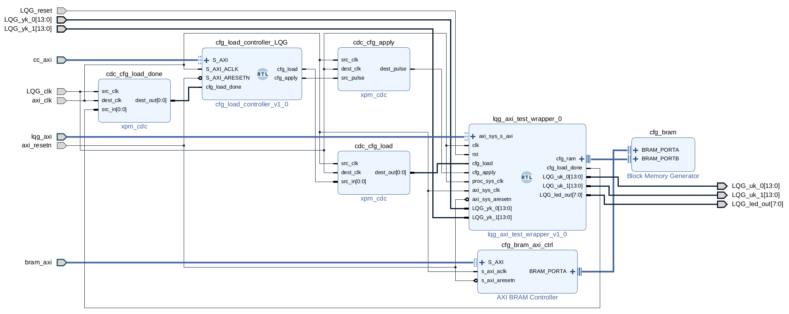

# coreconfig

`coreconfig` is a tool that helps integrating and interfacing with IP cores
designed with Vitis Model Composer into FPGA designs.

## General Concept

The basic idea behind `coreconfig` is that the user describes the interfaces
and associated types of an IP core created in VMC (Vitis Model Composer) in a 
single YAML file, which then can be used to generate a Verilog wrapper and/or
serve as a description file for loading configuration values from MATLAB directly
via named handles instead of bits and offsets. This should help lower the
overall time spent setting up configuration and MATLAB interfaces for the
created IP cores and also make the project-specific code and cores more
clean and readable.

### Configuration

The core concept around which `coreconfig` is built around the idea of a configuration.
"Configuration" in this context refers to **input data to an IP core that
usually does not change often and is usually very broad (many bits) and
parallel in nature**. The configuration thus is one-way-only, CPU to IP core.

`coreconfig`'s architecture collects all configuration data into a configuration
image, which is just some data stored in a block RAM of the FPGA.
A *configuration map* provides a mapping from a bit offset and size, determined
by the datatype, within this configuration image, to a specific VMC IP core input.
The configuration image data in the block RAM is updated from the CPU via an
AXI interface bridge.

By defining the configuration map together with the IP core in a YAML file, it 
is possible to provide an automatic way to translate MATLAB configuration struct
data into bits, offsets and sizes, eliminating the need for the user to constantly
work with those magic numbers and update them across the project.

### So what is a configuration input in my VMC core?

Simple, any standard input or vector input gateway can be defined as a config
input.

### What about AXI gateways?

`coreconfig` provides a way to write through the AXI slave interface(s) from a
VMC ip core to the wrapper. This is useful if the user defines AXI based gateways
in their VMC ip core design. The direct AXI gateways provide a convenient way
to implement often- or periodically-updated interfaces besides the config
inputs.

### IP Core Wrapper

To be able to abstract away all those (usually many) configuration input
ports in the Vivado block, a Verilog wrapper is generated by the user via
the `coreconfig.py` tool (The CLI tool has a nice help integrated). This
wrapper then is placed into the block design. As you will notice, additional
ports are present on the wrapper which allow for it to read the configuration
image from the block RAM.

### Config Load Controller

`coreconfig` provides a very simple RTL block, called the Config Load Controller, which
is a simple AXI slave module, that produces control signals used for indicating
to the IP core wrapper when to load the new config image data from block RAM.

To use it in your Vivado project, just import the following RTL source files:

- `rtl/cfg_load_controller.v`
- `rtl/axil_reg_if.v`
- `rtl/axil_reg_if_wr.v`
- `rtl/axil_reg_if_rd.v`

### Putting it all together

The following block design presents a rather basic example of how to set up the
configuration interface etc. for a `coreconfig` based project. This is taken from
the LQG-FP7 project, you can take a look there for a "reference" design.



## CLI Tools

Currently, the project consists of two main CLI tools: `coreconfig/coreconfig.py`,
which is the normal CLI tool through which most operations are handled, and
`coreconfig/server.py` which is provides a simple way to expose the configuration
interface as a HTTP REST API on the Red Pitaya.

## IP Core Description File Format

A YAML IP core description file follows a predefined format which is outlined
below.

### Datatype Definitions

Before being able to define the IP core IOs, the associated datatypes must be
described in the IP core description file. This is done via the `datatypes`
root-level element. Here, all types referenced in the rest of the YAML file
must be defined in the following format:

```YAML
...

datatypes:
  [type name n]:
    size: [size in bits]
    signed: [true of false, default; false]
    fixpt_bin: [bits after binary point, 0 for integers; default: 0]
  
  [type name n+1]:
    ...

...
```

Since the type names are user-defined, it makes sense to give them a meaningful
value, which reflects the nature of the type itself. For example, a sensible name
for a 8 bit unsigned integer with 3 bits after the binary point would be
`ufix_8_3`, etc. Below is an example of how such a `datatypes` section might
look like:

```YAML
...

datatypes:
  logic_1:
    size: 1

  ufix_4_0:
    size: 4
    signed: false
    fixpt_bin: 0

  sfix_14_12:
    size: 14
    signed: true
    fixpt_bin: 12

...
```

### IP Core Definitions

In principle, a single YAML file can hold one or more IP core defintions. These
are created under the `ipcores` root level node. Usually, if more than one IP
core is defined in a single file, the CLI tools require the user to specify which
one should be used for the operation in question.

The general YAML structure looks like this:

```YAML
...

ipcores:
  [ip core name n]:
    ipcore_type_name: [actual name of the ipcore Verilog module generated by VMC, case sensitive!]

    memory_map:
      ... AXI memory mapping definitions would go here, optional section.

    axi_interfaces:
      ... Any AXI-slave interfaces are defined in this section, optional.

    inputs:
      ... All inputs to the VMC IP core

    outputs:
      ... All outputs from the VMC IP core

  [ip core name n+1]:
    ...
...
```

#### `memory_map`

The memory map section is useful if the user wants to use the Python
`server.py` provided by `coreconfig`. Here, the physical memory addresses specified
in the Vivado Address Editor are described:

```YAML
    ...
    memory_map:
      config_ram:
        base: [base address of AXI BRAM interface of config ram]
        size: [mapping size]
      loader:
        base: [base address of the config_load_controller]
        size: [mapping size]
      axi:
        [axi interface 1 name]:
          base: [base address of VMC core mapping]
          size: [mapping size]
        [axi interface 2 name]:
          base: [base address of VMC core mapping]
          size: [mapping size]
        ...
      dma:
        bram:
          base: [base address of the memory-mapped BRAM for storing descriptors]
          size: [mapping size]
        throttle:
          base: [base address where the throttle core IP is mapped]
          size: [mapping size]
        dmacore:
          base: [base address where the Xilinx DMA core IP is mapped]
          size: [mapping size]
        dma_target:
          base: [target memory base address]
          size: [target memory size]
    ...
```
        
#### `axi_interfaces`

Any AXI slave interfaces the user wants to break out to the wrapper must be 
defined here. Note that the name of the AXI interfaces **does matter**, it must
be the exact, case sensitive name given by VMC to the specific AXI interface
in question. If you are unsure, just place the raw VMC ip core in a block design
and look at the interface name.

```YAML
    ...
    axi_interfaces:
      [axi interface 1 name]:
        data_width: [data bus width in bits of the interface]
        addr_width: [address bus width in bits of the interface]
        clock: [*external* signal name of the AXI clock signal]
        
        inputs:
          [input 1 gateway name]:
            datatype: [datatype of the signal]
            offset: [axi offset]
          ...

        outputs:
          [output 1 gateway name]:
            datatype: [datatype of the signal]
            offset: [axi offset]
          ...
      ...
    ...
```

#### `inputs`

All non-AXI gateway inputs to the VMC ip core must be defined in this section.
For each input signal, you must defined either a `signal_map`, so mapping the
input gateway to an actual input pin on the final wrapper, or a `config_map`,
connecting the gateway to the config image.

```YAML
    ...
    inputs:
      [input gateway name 1]:
        datatype: [datatype of the input gateway]
        ssr: [optional; ssr value for vector gateways]

        signal_map: [conflicts with config_map]
          name: [name of the external signal]
          ssr_pack: [true or false, only for ssr > 1; see below]
          is_clock: [set to true if this is a clock signal]
          freq: [for clocks, frequency specifier, in Hz]
          active_low: [for logic interfaces, marks this as active low, e.g. reset]

        config_map: [conflicts with signal_map]
          offset: [offset, in bits, in the config image]
          stride: [if ssr > 1, the bits to skip for each next vector element]

        attributes: [optional]
          matlab_name: [if supplying config from a MATLAB struct, the struct path goes here]
    ...
```

- `ssr_pack`: If `true`, the whole vector will be packed into a single input
  port. If false, one port for each vector element will be generated, the user
  must define the name to include a `%d` somewhere in it to indicate where the
  index number of the vector element in the final port should go.

#### `outputs`

Same as the inputs, the VMC core output gateways must be defined in this
section. The only difference to the YAML of the output section is that there
is only a `signal_map` possible, since the `config_map` and configuration is
only for input signals.

### Example Workflow

- Create a new Vivado project from a reference, set up the basic config load
  controller as described above and AXI slave interfaces.
- Create the VMC design, use regular input gateways for configurations.
- Build the VMC core
- Write an ip core description in YAML as described above.
- Create a wrapper with `coreconfig.py <YAML file> genwrapper wrapper.v`
- Import the wrapper and IP core into Vivado, place the wrapper RTL block in your
  block design and connect it up with the config.
- Build the IP core itself.
- Use `coreconfig/server.py <YAML file>` on the RedPitaya to start a HTTP REST
  API server and directly interact with it via Matlab HTTP requests to write
  configuration and read/write to/from AXI gateway signals.

### Required Packages for `server.py`

The following packages need to be installed on the RP before the server works:

- `python3-yaml`
- `python3-bitarray`
- `python3-numpy`
- `python3-flask`

You can just install them with `apt install -y <package>`